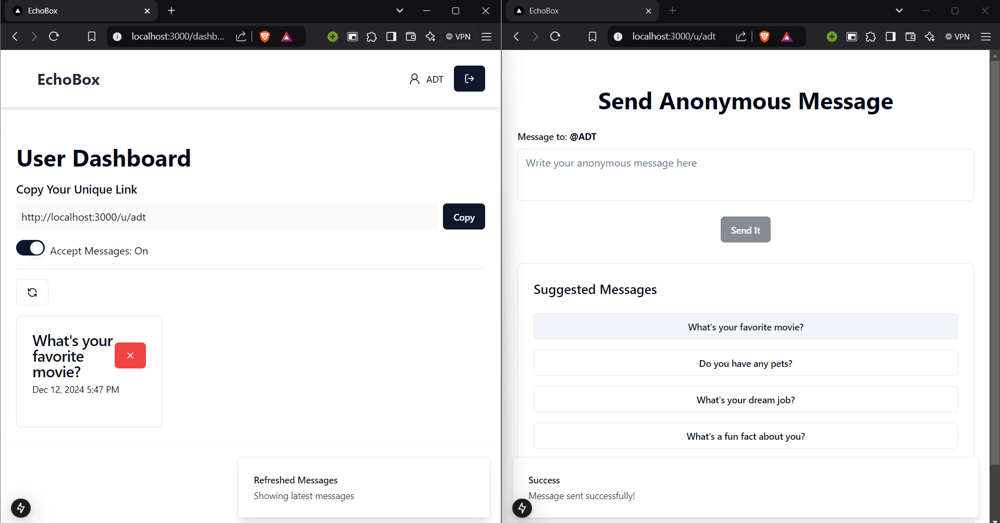

# EchoBox - Anonymous Message Sending App

EchoBox is a responsive, anonymous message-sending platform built with Next.js and TypeScript. It allows users to send and receive messages while maintaining anonymity. With features like OTP verification, message management, and personal message links, EchoBox ensures a smooth and secure user experience.

## Features

- **OTP Verification**: Users must verify their identity via OTP (powered by *Resend*) during signup.
- **Anonymous Messaging**: Users can share a unique link to receive messages anonymously.
- **Message Management**: Users can view, sort (by time), and delete received anonymous messages.
- **Message Toggle**: Users can toggle between accepting and rejecting new anonymous messages.
- **Username Availability Check**: Real-time debounced username check reduces database calls, ensuring a unique username.
- **Mongoose Pipeline**: Efficient message grouping for users using Mongoose aggregation pipeline.
- **Responsive Design**: Fully responsive, ensuring smooth usage on all devices.
- **Form Handling**: React Hook Form is used for managing forms with client-side validation powered by Zod.
- **Authentication**: Auth.js is used for secure user authentication and session management.
- **UI & Styling**: Built with Tailwind CSS and ShadCN for modern, clean, and fast UI development.
- **Notifications**: Real-time feedback to users via React Toast notifications.

## Tech Stack

- **Framework**: [Next.js](https://nextjs.org/)
- **Backend**: [Node.js](https://nodejs.org/), [Mongoose](https://mongoosejs.com/)
- **Database**: [MongoDB](https://www.mongodb.com/)
- **Authentication**: [Auth.js](https://authjs.dev/)
- **OTP Service**: [Resend](https://resend.com/)
- **Styling**: [Tailwind CSS](https://tailwindcss.com/), [ShadCN](https://shadcn.dev/)
- **Forms**: [React Hook Form](https://react-hook-form.com/) with validation from [Zod](https://zod.dev/)
- **Password Hashing**: [bcryptjs](https://www.npmjs.com/package/bcryptjs)
- **Type Checking**: [TypeScript](https://www.typescriptlang.org/)
- **Notifications**: [React Toast](https://react-hot-toast.com/)

## Project Overview

- **Signup and OTP Verification**: New users must sign up and verify their identity through an OTP sent via Resend. Once verified, they can log in.
- **Dashboard**: Upon successful login, users are redirected to their personal dashboard, where they can find their unique message link to share with others for receiving anonymous messages.
- **Message Management**: The dashboard displays all anonymous messages received, sorted by the most recent. Users can delete messages if needed.
- **Message Toggle**: Users can toggle the feature for accepting or rejecting anonymous messages.
- **Debouncing**: Username uniqueness is validated using debouncing, significantly reducing database call frequency.
- **Mongoose Aggregation**: Grouping of messages for a particular user is achieved using the Mongoose aggregation pipeline.
- **Form Handling**: React Hook Form is used for managing the signup and login forms, with validation handled by Zod.

## Getting Started

### Prerequisites

- Node.js (v14 or later)
- MongoDB
- Resend API key for OTP verification

### Installation

1. Clone the repository:

   ```bash
   git clone https://github.com/your-username/echobox.git
   cd echobox
2. Install dependencies:
    ```bash
    npm install
3. Set up environment variables:
    Create a .env.local file in the root directory and add the following:
    ```bash
    MONGODB_URI=<your-mongodb-connection-string>
    RESEND_API_KEY=<your-resend-api-key>
    NEXTAUTH_SECRET=<your-auth-secret>

4. Run the development server:
    ```bash
    npm run dev

5. Open http://localhost:3000 to view it in the browser.


## Screenshots

1. **Homepage**
   
   The homepage provides a brief introduction to EchoBox, featuring buttons to sign up or log in.

2. **Signin Page**
   
   Users can log in securely using the form. The form is built with React Hook Form.

3. **Signup Page (Debouncing in Action)**
   
   The signup page includes an OTP verification process with Resend, and username validation using debouncing. As users type, the form checks the availability of the username.

4. **Dashboard**
   
   The dashboard allows users to view incoming anonymous messages and manage their settings.

5. **Message Sharing Link**
   
   Logged-in users can share a unique link to receive anonymous messages. The user has the option to toggle between accepting or rejecting new messages through the dashboard.
